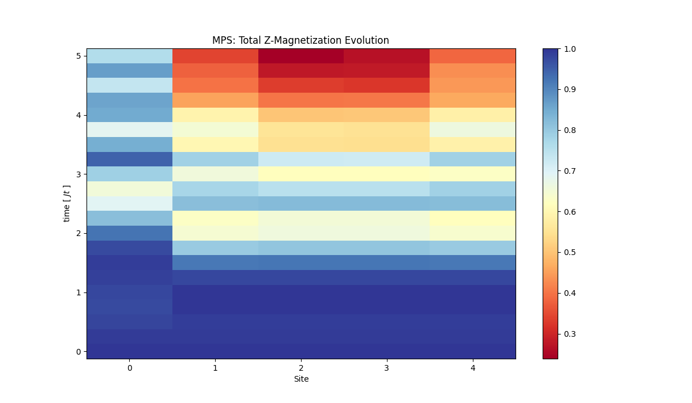
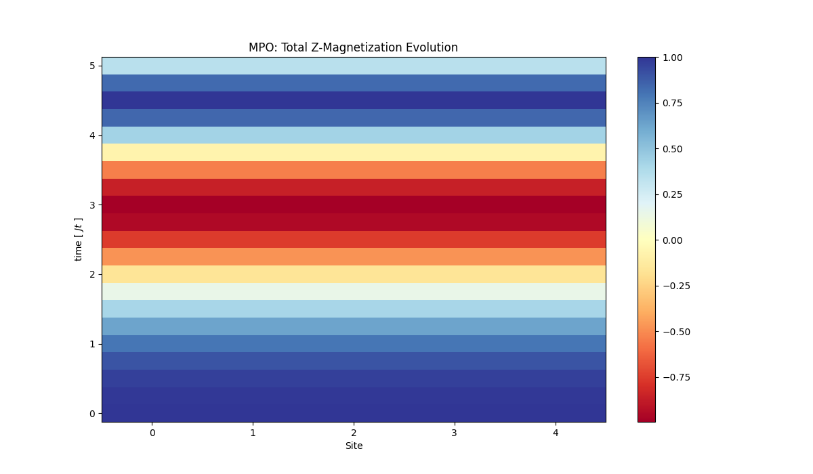
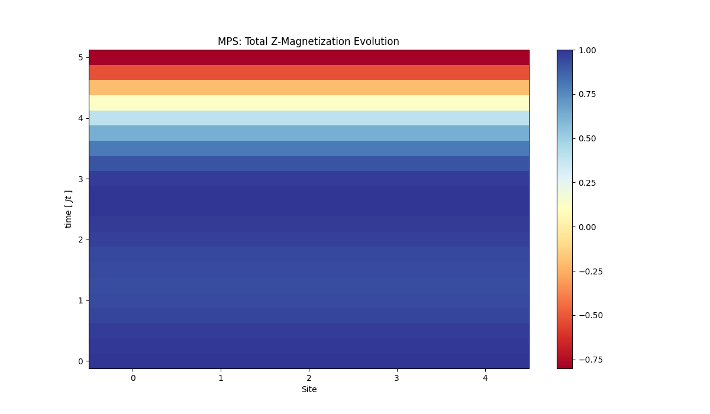
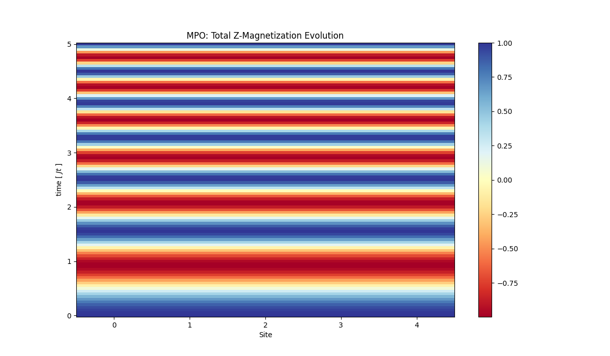
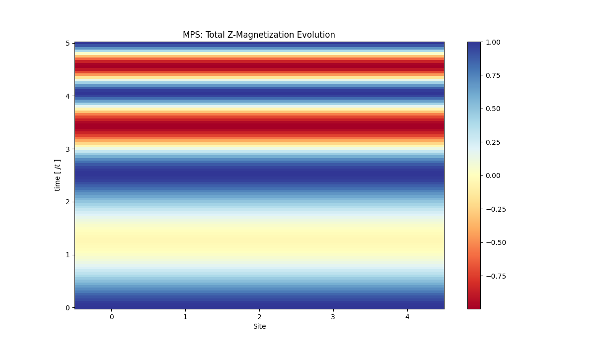
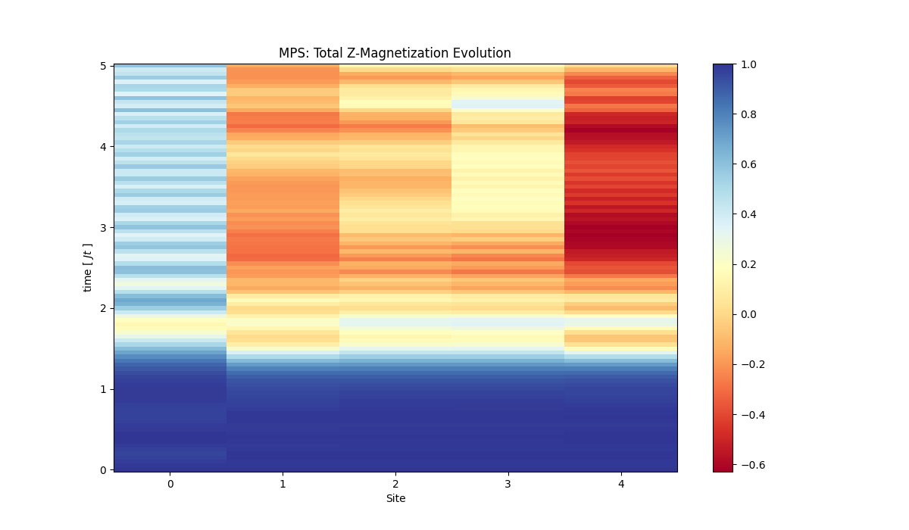

# MPS Evolution
## Case1: Wavefunction as zero

for fast transition [0, 1, 20]


for slow transition [0, 1, 100]


As we can see the later one is much more smoother.

## Case2: Wavefuction as |00100....0>

If real part of magnetization is ploted


# Compairing MPS and MPO evolution

## Case1: Wavefunction as zero


For fast transition `dt = 25/20` , `N=5` and `[0, 1, 20]`

With only both single qubit and two qubit gates

<p float="left">
  
  
</p>

With only single qubit gates

<p float="left">
  
  
</p>

For slow transition `dt = 5/20` , `N=5` and `[0, 1, 20]`

With only single gates

<p float="left">
  
  
</p>

With both single and two qubit gates

<p float="left">
  
  
</p>

## TODO:
```
# TODO:
# Read about Heisenberg model
# Spin chain evolution
# https://itp.tugraz.at/~evertz/QD/MPS_2015.pdf
# https://online.tugraz.at/tug_online/voe_main2.getvolltext?pCurrPk=54303
# Resources PEPS:
# Books, iTensor/TensorNetwork tutorials
```

1. a = <psi| IIII.I |psi> = 1 always
2. a = <psi| ZZZ.Z |psi> = -1^(n) (given psi = 0000...0)
3. For time evolution, starting MPO = zgate,mps contsant evolve by applying
layers to MPO. Initial Pauli IIIZIII (Z on jth index)
1.
