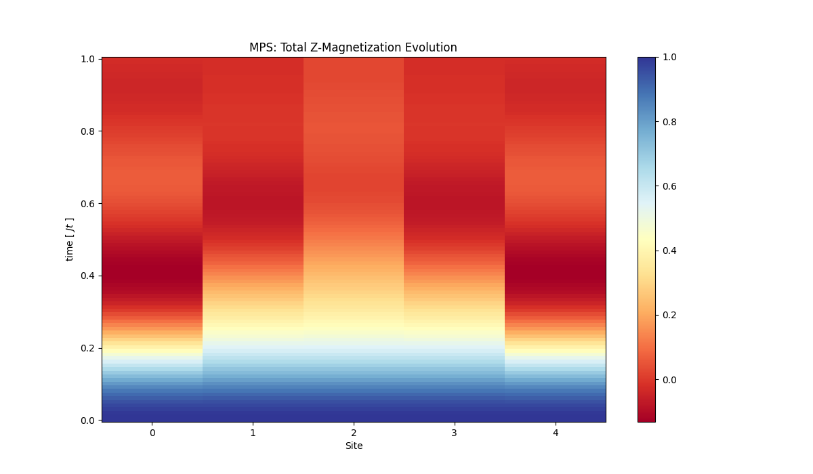
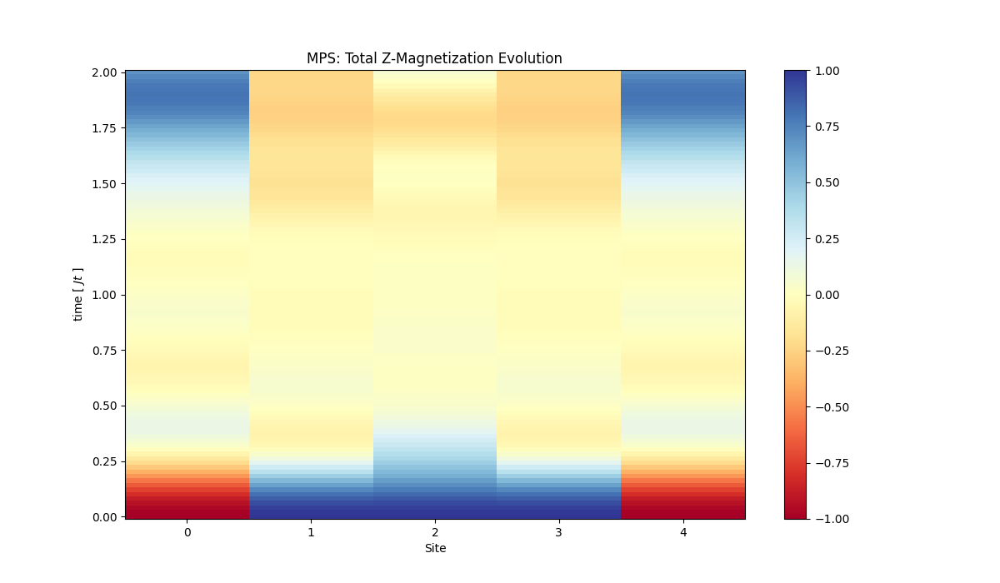
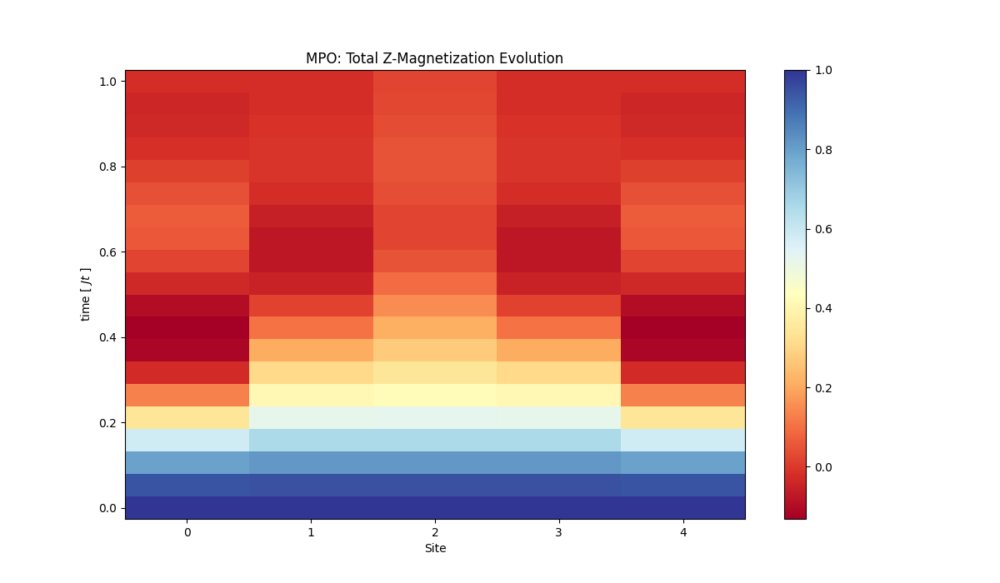

# MPS Evolution
Simulating for N = 5, N representing the number of qubits in the tensor network system.

Hamiltonian used : Ising Hamiltonian

## Case1: Wavefunction as zero

for fast transition [0, 1, 20]


for slow transition [0, 1, 100]


As we can see the later one is much more smoother.

## Case2: Wavefuction as |10010>
for fast transition [0, 1, 20]


for slow transition [0, 1, 100]



# MPO evolution

## Case1: Wavefunction as zero

for fast transition [0, 1, 20]


for slow transition [0, 1, 100]


## Case2: Wavefuction as |10010>
for fast transition [0, 1, 20]


for slow transition [0, 1, 100]


## TODO:
```
# TODO:
# Read about Heisenberg model
# Spin chain evolution
# https://itp.tugraz.at/~evertz/QD/MPS_2015.pdf
# https://online.tugraz.at/tug_online/voe_main2.getvolltext?pCurrPk=54303
# Resources PEPS:
# Books, iTensor/TensorNetwork tutorials
```

1. a = <psi| IIII.I |psi> = 1 always
2. a = <psi| ZZZ.Z |psi> = -1^(n) (given psi = 0000...0)
3. For time evolution, starting MPO = zgate,mps contsant evolve by applying
layers to MPO. Initial Pauli IIIZIII (Z on jth index)
1.
