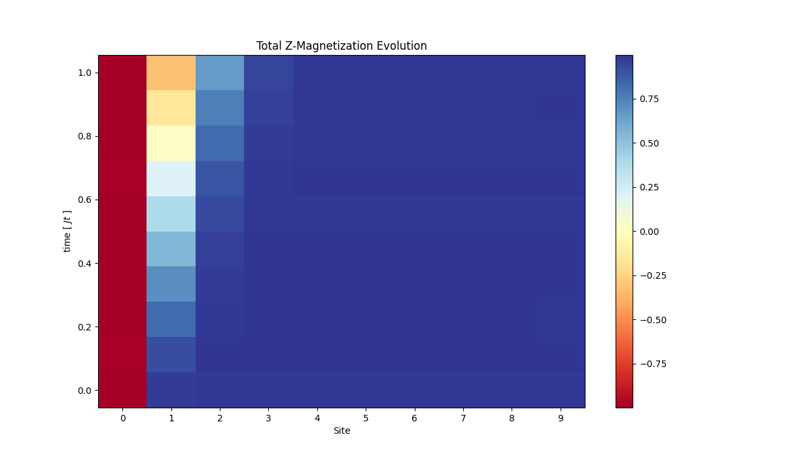

## Case1: Wavefunction as zero

for fast transition [0, 1, 20]


for slow transition [0, 1, 100]


As we can see the later one is much more smoother.

## Case2: Wavefuction as |00100....0>

If real part of magnetization is ploted


## TODO:
```
# TODO : Take cutoff into consideration
# for magnetization

# TODO: Check cutoff and tolerance

# Check state 0 and then check expectation 1 0 0 0
# Check singular values
# Check sum of prob going > 1

# Plot initial values at t = 0

```
